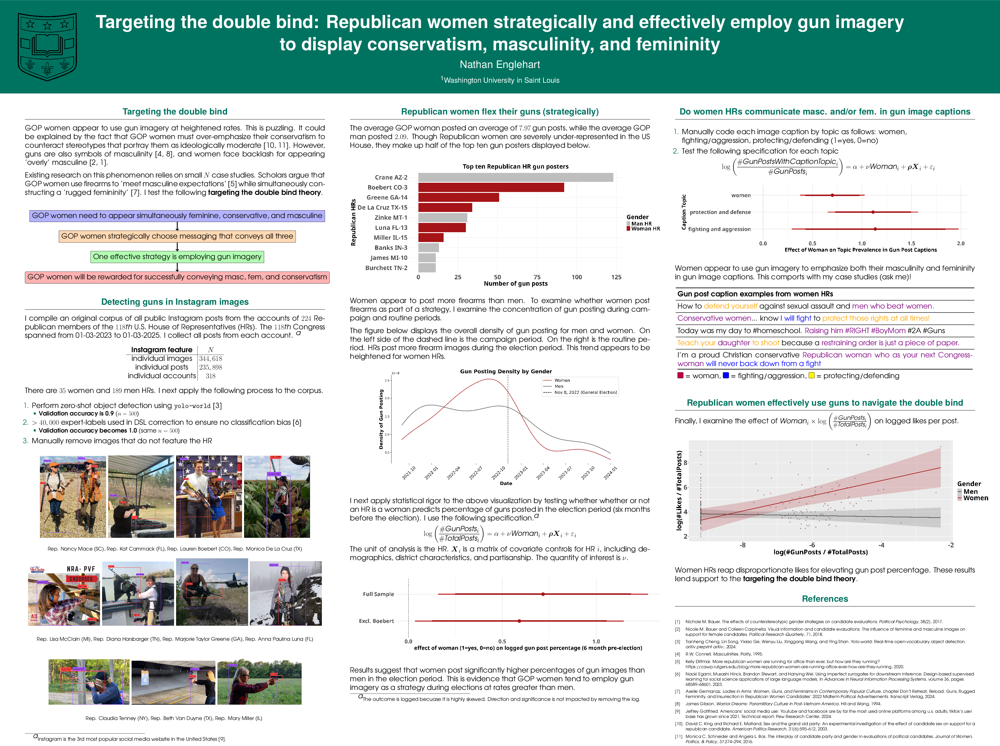

### Compilation

Can be fully compiled with `bash compile.sh` (for everything including citations). For a faster compilation that will not include the bibliography:

```
xelatex -interaction=nonstopmode poster.tex
```

Sometimes this can be slow -- but is much faster than overleaf, plus no fees!

### Result

Below is my compiled poster from MARGIE 2025. 

<p align="center">
    
</p>

### Notes

Adapted from template found on overleaf (see MIT license).
